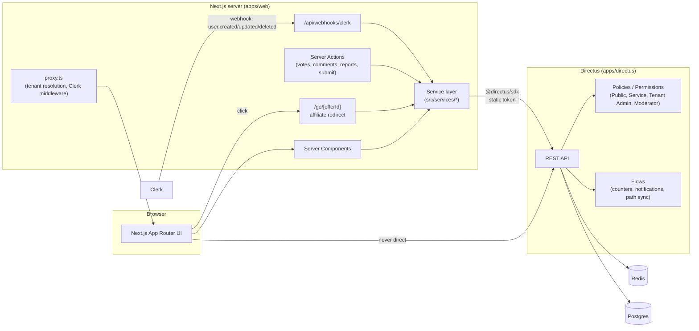
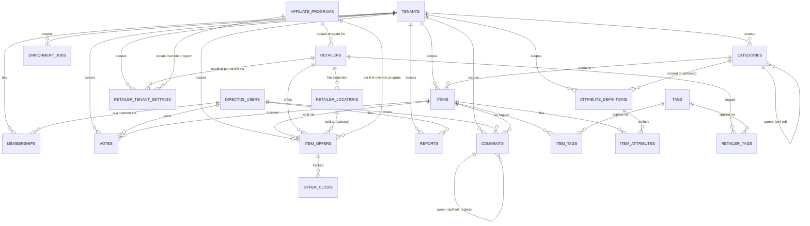

# BucketBoard

A multi-tenant "community favourites" platform: users submit and vote on items
(products, places, anything worth recommending), organised into a per-tenant
category tree, with affiliate-aware links out to retailers. One codebase, one
Directus instance, any number of independently branded tenants — a supermarket
favourites site today, a homeware or electronics vertical tomorrow, launched
by cloning a category tree rather than writing new code.

**Stack**: [Directus 11](https://directus.io) (Postgres + Redis) as the
backbone — schema, permissions, and automation as code — behind a
[Next.js 16](https://nextjs.org) (App Router) frontend that never talks to
Directus from the browser. [Clerk](https://clerk.com) handles end-user auth
and is synced into `directus_users`. Everything is TypeScript, strict, no
`any`, validated at every boundary with [Zod](https://zod.dev).

## Contents

- [Architecture](#architecture)
- [Data model](#data-model)
- [Affiliate link resolution](#affiliate-link-resolution)
- [Repository layout](#repository-layout)
- [Getting started](#getting-started)
- [Directus: schema, permissions, flows](#directus-schema-permissions-flows)
- [Seeding & launching a new tenant](#seeding--launching-a-new-tenant)
- [Clerk setup](#clerk-setup)
- [Multi-tenant routing](#multi-tenant-routing)
- [Testing & CI](#testing--ci)
- [Deployment](#deployment)
- [Known limitations](#known-limitations)

## Architecture



**Clean layering, enforced by convention**: UI components → Server
Components / Server Actions / route handlers → `src/services/*` → typed
`@directus/sdk` client. No component or page ever imports the Directus SDK
directly, and there are two SDK clients (`src/lib/directus/client.ts`):

- `getPublicDirectusClient()` — anonymous, safe to call from cacheable
  (ISR-friendly) code paths; scoped by the Directus **Public** policy.
- `getServiceDirectusClient()` — server-only (`import 'server-only'`),
  authenticated with a static token as the narrowly-scoped **Service** role.
  Used by server actions and anything that needs to read/write on behalf of
  the signed-in user, submit content, or record a vote/click.

The browser **never** holds a Directus token. All mutations go through a
Next.js Server Action or route handler (the BFF), which authorizes the
request (Clerk session) and then calls Directus with the Service token —
enforced both in application code and, defense-in-depth, in Directus's own
permission rules per role.

## Data model

Every content collection carries a `tenant` M2O and is scoped by it — with
one deliberate exception: **retailers are platform-level and shared**
across tenants (Tesco is still Tesco whether you're running the supermarket
favourites site or the homeware one), and per-tenant overrides (enabled
status, affiliate credentials) live in `retailer_tenant_settings`.



| Collection                                  | Purpose                                                                                                                                                                                       |
| ------------------------------------------- | --------------------------------------------------------------------------------------------------------------------------------------------------------------------------------------------- |
| `tenants`                                   | One row per branded community (supermarket, homeware, …). Domain, theme, locale/currency defaults.                                                                                            |
| `memberships`                               | Links a `directus_users` row to a `tenant` with a role (`member`/`moderator`/`admin`) and karma.                                                                                              |
| `categories`                                | Per-tenant tree (self-referencing `parent`), materialised `path`/`depth` kept in sync by a Flow.                                                                                              |
| `tags` / `item_tags` / `retailer_tags`      | Free-form tagging, optionally tenant-scoped (`tags.tenant` nullable = platform-wide tag).                                                                                                     |
| `items`                                     | The submitted things — title, category, vote/comment/offer counters kept denormalised for list performance.                                                                                   |
| `attribute_definitions` / `item_attributes` | Per-tenant (optionally per-category) custom fields (EAV-style) so each vertical can add its own facets without a schema change.                                                               |
| `votes`                                     | One row per (item, user), `value` up/down; a Flow re-aggregates `items.votes_up/down/vote_score` on change.                                                                                   |
| `comments`                                  | Threaded (self-referencing `parent`) per item.                                                                                                                                                |
| `reports`                                   | Polymorphic (`target_collection` + `target_id`) moderation reports against items or comments; a Flow notifies tenant moderators.                                                              |
| `retailers`                                 | **Platform-level, not tenant-scoped.** Shared catalogue of stores (Ocado, Tesco, Amazon, independent shops, brand-direct, …).                                                                 |
| `retailer_tenant_settings`                  | Per-(tenant, retailer) enable flag + affiliate credential override.                                                                                                                           |
| `affiliate_programs`                        | Network-level link templates (Awin, CJ, direct, …), reusable across retailers/tenants.                                                                                                        |
| `item_offers`                               | A specific "buy this item at this retailer" link, with its own optional affiliate override.                                                                                                   |
| `retailer_locations`                        | Physical branches (for the store-locator pages), each with opening hours / geo.                                                                                                               |
| `offer_clicks`                              | Append-only outbound click log, written by `/go/[offerId]`.                                                                                                                                   |
| `enrichment_jobs`                           | Queue rows for background offer enrichment (price/availability lookups) — schema and permissions are in place; **no worker processes them yet**, see [Known limitations](#known-limitations). |

Full field-level types live in `packages/shared/src/collections/*.ts` and are
passed as the generic to `createDirectus<BucketBoardSchema>()`, so every SDK
call in the service layer is typed end-to-end from the schema definition.

## Affiliate link resolution

The core business rule of the whole platform is a single pure function,
[`resolveOutboundUrl`](packages/shared/src/domain/resolveOutboundUrl.ts)
(unit tested in
[`resolveOutboundUrl.test.ts`](packages/shared/src/domain/__tests__/resolveOutboundUrl.test.ts)),
called by the `/go/[offerId]` route handler. It resolves, in strict
precedence order:

1. **`offer.affiliateUrl`** — a hand-crafted link, used verbatim, if the
   offer has `overrideDefaults: true`.
2. **`offer.affiliateProgram`** — a per-link affiliate program override,
   templated with the offer's own affiliate id/params.
3. **Tenant-scoped settings** (`retailer_tenant_settings`) — if enabled for
   this tenant, the tenant's own affiliate program/id/params.
4. **Retailer default** — the retailer's own `default_affiliate_program` /
   `link_template`.
5. **Raw URL** — no affiliate relationship configured; link straight to the
   retailer, no tracking.

Templates are rendered one of two ways depending on shape: templates
starting with the literal `{url}` token (e.g. `{url}?tag={affiliate_id}`,
the common "retailer reads its own query param" case) are merged onto the
real destination with `URLSearchParams` so we never double-encode or clobber
an existing param; anything else (typically a network redirect wrapper like
Awin's `cread.php?...&ued={encoded_url}`) is rendered as plain string
substitution. The resolved `rel` attribute (`noopener noreferrer`, plus
`nofollow`/`sponsored` as required) is computed alongside the `href` so
outbound `<a>` tags satisfy UK ASA/CMA affiliate-disclosure expectations
without each call site re-deriving it — see also `/affiliate-disclosure`
(`apps/web/src/app/t/[tenant]/affiliate-disclosure/page.tsx`) and the
disclosure text rendered next to offer lists.

`/go/[offerId]` (`apps/web/src/app/go/[offerId]/route.ts`) fetches the offer

- retailer + tenant settings, calls `resolveOutboundUrl`, records an
  `offer_clicks` row, and issues a redirect — it is excluded from
  `sitemap.ts`/`robots.txt` since it's a tracking endpoint, not a page.

Two other pure functions get the same unit-test treatment because they're
similarly load-bearing and easy to get subtly wrong:

- [`recomputeCategoryPaths`](packages/shared/src/domain/categoryPath.ts) —
  materialises `path`/`depth` for a category tree, detects cycles and
  unknown parents. Backs both the "Category Path Sync" Flow (single-node,
  live) and the standalone `recompute-category-paths` CLI (whole-tree
  repair).
- [`toggleVote`](packages/shared/src/domain/voteToggle.ts) — up/down/unvote
  state transitions for a single user's vote on an item.

## Repository layout

```
bucketboard/
├── apps/
│   ├── directus/          # Schema-as-code, permissions, flows, seed, tenant-clone
│   │   └── src/
│   │       ├── schema/        # Collection/field/relation definitions + apply.ts
│   │       ├── permissions/   # Policy/role/permission definitions + apply.ts
│   │       ├── flows/         # Flow definitions + apply.ts
│   │       ├── seed/          # Idempotent demo-tenant seed data
│   │       ├── tenant-clone/  # Zero-schema-change new-tenant launcher
│   │       └── taxonomy/      # Whole-tree category path repair CLI
│   └── web/                # Next.js App Router frontend
│       └── src/
│           ├── app/            # Routes (see below)
│           ├── services/       # The only code that imports @directus/sdk
│           ├── actions/        # 'use server' mutations (votes, comments, reports, submit)
│           ├── components/     # UI (shadcn/ui primitives + feature components)
│           ├── lib/             # Directus clients, env, auth, tenant context, OG helper
│           └── proxy.ts        # Clerk middleware + domain → tenant rewrite
├── packages/
│   └── shared/              # Directus schema types, Zod validation, pure domain functions
├── docker-compose.yml        # Postgres + Redis + Directus
└── .github/workflows/ci.yml  # lint, typecheck, test, build
```

Frontend routes, all under a resolved tenant (see
[Multi-tenant routing](#multi-tenant-routing)):

| Route                                | Purpose                                                                 |
| ------------------------------------ | ----------------------------------------------------------------------- |
| `/`                                  | Tenant home — top categories, hot items.                                |
| `/c/[...path]`                       | Category page (arbitrary depth), with breadcrumb, sort, retailer facet. |
| `/i/[slug]`                          | Item detail — offers, votes, comments, attributes, JSON-LD.             |
| `/s/[retailer-slug]`                 | Retailer page (offers across items, at this tenant).                    |
| `/s/[retailer-slug]/[location-slug]` | A specific branch — address, hours, map link.                           |
| `/stores`                            | Store/retailer directory.                                               |
| `/shops`                             | Independent-shop directory (a `retailers.kind` filter of `/stores`).    |
| `/submit`                            | Submit a new item (auth required).                                      |
| `/search`                            | Full-text search across items.                                          |
| `/u/[username]`                      | Public profile — a member's submissions/activity.                       |
| `/about`, `/affiliate-disclosure`    | Static content.                                                         |
| `/sign-in`, `/sign-up`               | Clerk-hosted auth UI.                                                   |
| `/go/[offerId]`                      | Affiliate redirect (see above); excluded from sitemap/robots.           |
| `/api/webhooks/clerk`                | Svix-verified Clerk → `directus_users` sync.                            |

There are deliberately no custom `/admin` routes — tenant/content
administration happens in the Directus admin app itself, gated by Directus
roles (`Tenant Admin`, `Moderator`).

## Getting started

Prerequisites: Node ≥ 20, pnpm ≥ 9 (repo pins `pnpm@10.33.0` via
`packageManager`), Docker (for Postgres/Redis/Directus). `docker-compose.yml`
pins `directus/directus:11`; if pointing the apply scripts at an existing
Directus instance instead, it must also be Directus ≥ 11 — `permissions:apply`
depends on the Policies/Access model introduced in that major version and
fails fast with a clear error against anything older.

```bash
git clone https://github.com/kipergil/bucketboard.git
cd bucketboard
pnpm install

# 1. Directus env — copy and fill in (defaults work for local dev as-is)
cp apps/directus/.env.example apps/directus/.env

# 2. Start Postgres + Redis + Directus
docker compose up -d

# 3. Apply schema, permissions, and flows (idempotent — safe to re-run)
pnpm schema:apply
pnpm permissions:apply   # prints the Service account's static token — copy it
pnpm flows:apply

# 4. Seed the demo "supermarket" tenant (categories, retailers, items, offers)
pnpm db:seed

# 5. Web app env
cp apps/web/.env.example apps/web/.env.local
# paste the Service token from step 3 into DIRECTUS_SERVICE_TOKEN,
# and your Clerk keys (see "Clerk setup" below)

pnpm --filter=./apps/web dev
```

Then open `http://localhost:3000` — `proxy.ts` will serve
`NEXT_PUBLIC_DEFAULT_TENANT_SLUG` (`supermarket` by default) for any
hostname it doesn't recognise as a configured tenant domain, so local dev
never needs `/etc/hosts` edits. Directus admin: `http://localhost:8055`
(`ADMIN_EMAIL`/`ADMIN_PASSWORD` from `apps/directus/.env`).

## Directus: schema, permissions, flows

Everything Directus-side is declarative code under `apps/directus/src/`,
applied via idempotent scripts rather than clicked together in the admin UI
— so the whole backend is reviewable, diffable, and reproducible:

- **`pnpm schema:apply`** (`src/schema/apply.ts`) — creates/updates every
  collection, field, and relation from `src/schema/definitions/*.ts` in a
  3-pass run (collections → fields → relations, so forward references
  resolve). Composite unique constraints that Directus's schema API can't
  express (e.g. one vote per (item, user); one category slug per
  (tenant, parent)) are added with raw SQL in `src/schema/constraints.ts`,
  including partial indexes for the nullable-tenant/nullable-parent edge
  cases. `pnpm schema:snapshot` dumps the live schema to
  `apps/directus/schema/snapshot.yaml`, committed for reference/diffing.
- **`pnpm permissions:apply`** (`src/permissions/apply.ts`) — creates four
  policies: **Public** (anonymous read of published content, scoped to
  `status = published`-style filters, plus `directus_files` read so image
  assets load), **Service** (the Next.js BFF's static-token role — broader
  read, narrow write, no direct end-user auth), **Tenant Admin** and
  **Moderator** (tenant-scoped via a `tenant` field-filter on every rule,
  for staff signed into the Directus admin app). Prints the Service
  account's static token on first run.
- **`pnpm flows:apply`** (`src/flows/apply.ts`) — four automation flows,
  each starting with a "normalize affected id" step (Directus's `action`
  event payload shape differs between create and update — a `key` vs.
  `keys[0]` — so every flow re-reads the row fresh rather than trusting
  `$trigger.payload` for fields that might be absent on either path):
  - **Vote Counter Sync** — on `votes` create/update/delete, re-aggregates
    `items.votes_up/down/vote_score`.
  - **Comment Counter Sync** — on `comments` create/update/delete,
    recomputes `items.comment_count` (published comments only).
  - **Report Notifications** — on `reports` create, notifies tenant
    moderators.
  - **Category Path Sync** — on `categories` create/update, recomputes that
    node's `path`/`depth` from its parent (uses the same tested algorithm as
    the standalone `recompute-category-paths` CLI, which repairs an entire
    tree at once if it ever drifts).

## Seeding & launching a new tenant

```bash
pnpm db:seed
```

Idempotent — safe to re-run. Creates a `supermarket` launch tenant with a
3-level, ~50-category UK grocery tree; nine retailers spanning major online
supermarkets (Ocado, Tesco), a marketplace (Amazon), brand-direct stores,
and independent shops (including Turkish and Greek grocers, to exercise the
`retailers.kind` facet used by `/shops`); a handful of seed items with
multiple offers each; and three demo memberships (member/moderator/admin)
so the different Directus roles have something to sign in as.

```bash
pnpm tenant:clone --from supermarket --to homeware --name "Homeware Favourites"
```

Launches a new vertical **with zero schema changes**: clones the source
tenant's category tree and attribute definitions, and re-creates
`retailer_tenant_settings` rows enabling the same shared retailers for the
new tenant (without copying credentials — each tenant configures its own
affiliate IDs). Items, votes, and comments are intentionally _not_ cloned;
the new tenant starts with an empty content slate on a ready-made structure.

## Clerk setup

1. Create a Clerk application at [dashboard.clerk.com](https://dashboard.clerk.com),
   enable email/password and Google OAuth (the provider abstraction in
   `src/lib/auth/provider.ts` makes adding Apple/GitHub/Facebook later a
   config change, not a code change).
2. Copy the publishable + secret keys into `apps/web/.env.local`
   (`NEXT_PUBLIC_CLERK_PUBLISHABLE_KEY`, `CLERK_SECRET_KEY`).
3. Add a webhook endpoint (Clerk Dashboard → Webhooks) pointing at
   `https://your-domain/api/webhooks/clerk`, subscribed to `user.created`,
   `user.updated`, `user.deleted`; copy its signing secret into
   `CLERK_WEBHOOK_SECRET`. The handler
   (`src/app/api/webhooks/clerk/route.ts`) verifies the signature with
   `svix` and upserts a `directus_users` row.
4. The webhook is the primary sync path, but every server-side auth check
   also has a **JIT fallback**
   (`getCurrentDirectusUser`/`requireCurrentDirectusUser` in
   `src/lib/auth/current-user.ts`): if a Clerk-authenticated request arrives
   for a user Directus doesn't know about yet (webhook not yet delivered,
   or misconfigured in a given environment), it creates the `directus_users`
   row on the spot rather than failing the request.

This path is implemented and typechecked but not end-to-end tested in this
environment, since doing so requires a real Clerk application — there is no
way to obtain real Clerk credentials from within this sandbox. `apps/web/.env.local`
here uses a syntactically-valid but non-functional placeholder key so local
builds succeed; sign-in will not work until real keys are supplied.

## Multi-tenant routing

Filesystem routes live under `apps/web/src/app/t/[tenant]/...`.
`src/proxy.ts` (Next.js 16 renamed `middleware.ts` → `proxy.ts`) wraps
`clerkMiddleware` and, for every request, resolves a tenant slug — by
matching the request's hostname against a configured `tenants.domain` — and
transparently rewrites into `/t/<slug>/...`, so a production domain like
`favourites.example.com` never shows `/t/...` in the URL. A short list of
global (non-tenant) prefixes — `/sign-in`, `/sign-up`, `/api`, `/go`,
`/sitemap.xml`, `/robots.txt`, `/manifest.webmanifest` — is excluded from
the rewrite. In local dev, where there's no real tenant domain to match,
unmatched hostnames fall back to `NEXT_PUBLIC_DEFAULT_TENANT_SLUG`; visiting
`/t/<other-slug>/...` directly also works, for testing a second tenant
without a second domain.

## Testing & CI

```bash
pnpm test        # vitest, all workspaces
pnpm lint         # eslint, all workspaces
pnpm typecheck    # tsc --noEmit, all workspaces
pnpm format:check # prettier --check .
pnpm build        # packages/shared + apps/web
```

`packages/shared` has real unit tests for the three pure domain functions
described [above](#affiliate-link-resolution) (27 tests: affiliate
resolution precedence/template rendering, category path recomputation +
cycle detection, vote toggle transitions). `apps/directus` and `apps/web`
run `vitest run --passWithNoTests` — their logic is either thin
orchestration over the tested pure functions and the Directus SDK, or was
verified by hand against a live Directus instance during development
(schema apply, permissions, flows, seed idempotency, the full affiliate
redirect chain, every route) rather than mocked in unit tests.

`.github/workflows/ci.yml` runs format-check → lint → typecheck → test →
build on every push/PR, using placeholder-but-well-formed env values (valid
URL shapes, a syntactically-valid dummy Clerk publishable key) so the build
step doesn't require a live Directus/Clerk instance — no page performs
build-time (`generateStaticParams`) data fetching, so this is sufficient to
catch real compile/type/lint regressions without standing up services in CI.

## Deployment

- **Directus**: `docker-compose.yml` is a development stack (bind-mounted
  local volumes, host-exposed Postgres/Redis ports). For production, run
  the same `directus/directus:11` image against a managed Postgres + Redis
  (or equivalent), set `KEY`/`SECRET` to real random values, put real
  storage (S3-compatible) behind `STORAGE_LOCATIONS`, and run
  `schema:apply` / `permissions:apply` / `flows:apply` as part of your
  deploy pipeline (all idempotent).
- **Next.js**: standard `apps/web` App Router deploy (Vercel or any
  Node host) — `pnpm --filter=./apps/web build && pnpm --filter=./apps/web start`.
  Needs the full `apps/web/.env.example` list of env vars set for real, plus
  each production tenant's `domain` set correctly in the `tenants`
  collection so `proxy.ts` can route it.

## Known limitations

- **`enrichment_jobs`** has a full schema (collection, fields, permissions)
  for a background offer-enrichment queue (price/availability lookups feeding
  `item_offers.enrichment_*`), but no worker consumes the queue yet — jobs
  can be written but nothing processes them. `ENRICHMENT_LLM_API_KEY`/`_MODEL`
  env vars are wired through in anticipation of this.
- **Clerk auth is untested end-to-end** in this environment (see
  [Clerk setup](#clerk-setup)) — code is complete and typechecked, but
  needs real Clerk credentials to verify sign-in, the webhook, and the JIT
  fallback actually work together.
- **Category OG images** (`opengraph-image.tsx` under
  `/t/[tenant]/c/[...path]`) were dropped: Next.js/Turbopack rejects an
  `opengraph-image` route nested under a catch-all (`[...path]`) segment
  ("catch all segment must be the last segment") — a framework limitation,
  not something fixable without restructuring the category route away from
  a catch-all. Tenant/item/retailer/store OG images are unaffected and work.
